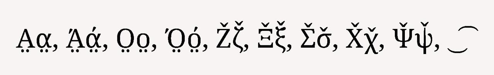
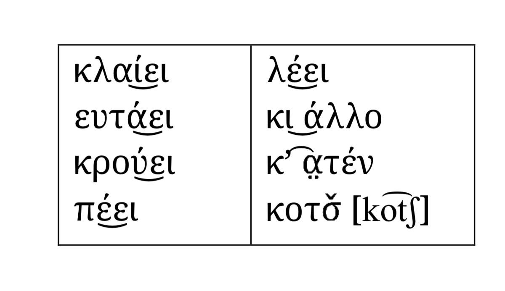

# Понтийский язык для греческой клавиатуры на iOS/macOS

Представленный датасет **Понтийского (Ποντιακά)** содержит данные для системной клавиатуры на iOS/macOS для греческой раскладки.  
Датасет подготовлен для использования в системах ввода (например, Apple Keyboard, Unicode CLDR и других).
Основой для датасета послужили стандартные раскладки греческого языка (не политонические) на различных типах устройств iOS/macOS.

## 📘 Описание

Датасет для расскладки клавиатуры основан на современном дизайне, используемом в iOS и macOS.

Раскладки соответствуют унифицированной схеме клавиатуры, и совместимы с инструментами генерации раскладок для конкретных платформ.

## 🧩 Структура директории

```
pontic/
 ├── README.md
 ├── pnt-3-rows.yaml
 ├── pnt-longpress.yaml
 ├── pnt-macos.yaml
 ├── pontic_letters.jpg
 └── pontic_various_breve.jpg
```

## Особенности понтийского алфавита

Алфавит понтийского языка сопоставим с алфавитом новогреческого языка, при этом обладает некоторыми дополнительными особенностями.
Так в понтийсмком языке фиксируются доплнительные звуки, в следствие чего и буквы:



Задача реализовать все буквы при помощи комбинированных символов Unicode:

### Буквы с умлаутом снизу (◌̤) в понтийской орфографии

| Буква | Вид | Базовый символ (Hex) | Комбинируемый знак (Hex) | Результат |
|------|-----|----------------------|--------------------------|-----------|
| Α | Α с точками внизу | U+0391 | U+0391 U+0324 | Α̤ |
| α | α с точками внизу | U+03B1 | U+03B1 U+0324 | α̤ |
| Ά | Α с ударением и точками | U+0386/U+0391 U+0301 | U+0386 U+0324/U+0391 U+0301 U+0324 | Ά̤ |
| ά | α с ударением и точками | U+03AC/U+03B1 U+0301 | U+03AC U+0324/U+03B1 U+0301 U+0324 | ά̤ |
| Ο | Ο с точками внизу | U+039F | U+039F U+0324 | Ο̤ |
| ο | ο с точками внизу | U+03BF | U+03BF U+0324 | ο̤ |
| Ό | Ο с ударением и точками | U+038C/U+039F U+0301 | U+038C U+0324/U+039F U+0301 U+0324| Ό̤ |
| ό | ο с ударением и точками | U+03CC/U+03BF U+0301 | U+03CC U+0324/U+03BF U+0301 U+0324| ό̤ |

### Буквы с гачеком (◌̌) в понтийской орфографии

| Буква | Звук (прим.) | Базовый символ (Hex) | Комбинируемый знак (Hex) | Результат |
|------|--------------|----------------------|--------------------------|-----------|
| Ζ    | Ж        | U+0396               | U+0396 U+030C            | Ζ̌         |
| ζ | ж | U+03B6 | U+03B6 U+030C | ζ̌ |
| Ξ | Кш  | U+039E | U+039E U+030C | Ξ̌ |
| ξ | кш | U+03BE | U+03BE U+030C | ξ̌ |
| Σ | Ш  | U+03A3 | U+03A3 U+030C | Σ̌ |
| σ | ш | U+03C3 | U+03C3 U+030C | σ̌ |
| Χ | Ш | U+03A7 | U+03A7 U+030C | Χ̌ |
| χ | ш | U+03C7 | U+03C7 U+030C | χ̌ |
| Ψ | Пш | U+03A8 | U+03A8 U+030C | Ψ̌ |
| ψ | пш | U+03C8 | U+03C8 U+030C | ψ̌ |

### Символ бреве комбинированный

В данной версии не планируется реализовывать вариант с комбинированным бреве, но для будущих проектов будут приведены примеры его применения в естественном языке



## Dead Keys 

Примеры использования Dead Keys и их комбинации, как это должно работать. Принцип работы у данных над/подстрочных знаков должен быть такой: сначала выбирается буква, а затем к ней добавляются символы надстрочные и подстрочные.

Ά = Α + ΄<br>
ά = α + ΄<br>
Έ = Ε + ΄<br>
έ = ε + ΄<br>
Ή = Η + ΄<br>
ή = η + ΄<br>
Ί = Ι + ΄<br>
ί = ι + ΄<br>
Ό = Ο + ΄<br>
ό = ο + ΄<br>
Ύ = Υ + ΄<br>
ύ = υ + ΄<br>
Ώ = Ω + ΄<br>
ώ = ω + ΄<br>

Ϊ = Ι + ¨<br>
ϊ = ι + ¨<br>
Ϋ = Υ + ¨<br>
ϋ = υ + ¨<br>

Ϊ́ = Ι + ΅<br>
ΐ = ι + ΅<br>
Ϋ́ = Υ + ΅<br>
ΰ = υ + ΅<br>

Α̤ = Α + ˇ<br>
α̤ = α + ˇ<br>
Ο̤ = Ο + ˇ<br>
ο̤ = ο + ˇ<br>
Ζ̌ = Ζ + ˇ<br>
ζ̌ = ζ + ˇ<br>
Ξ̌ = Ξ + ˇ<br>
ξ̌ = ξ + ˇ<br>
Σ̌ = Σ + ˇ<br>
σ̌ = σ + ˇ<br>
Χ̌ = Χ + ˇ<br>
χ̌ = χ + ˇ<br>
Ψ̌ = Ψ + ˇ<br>
ψ̌ = ψ + ˇ<br>

Ϊ́ = Ι + ¨ + ΄<br>
ΐ = ι + ¨ + ΄<br>
Ϋ́ = Υ + ¨ + ΄<br>
ΰ = υ + ¨ + ΄<br>

Ά̤ = Α + ΄ + ˇ<br>
ά̤ = α + ΄ + ˇ<br>
Ό̤ = Ο + ΄ + ˇ<br>
ό̤ = ο + ΄ + ˇ<br>

---

# Pontic Language for Greek Keyboard on iOS/macOS

This dataset for Pontic language (Ποντιακά) provides data for a system keyboard on iOS/macOS based on the Greek layout.
The dataset is intended for use in input systems such as Apple Keyboard, Unicode CLDR, and similar platforms.
The dataset is based on standard modern Greek (non-polytonic) keyboard layouts used across various iOS and macOS devices.

## 📘 Description

The keyboard layout dataset is based on the modern keyboard design used in iOS and macOS.

The layouts follow a unified keyboard schema and are compatible with layout generation tools for specific platforms.

## 🧩 Directory structure

```
pontic/
 ├── README.md
 ├── pnt-3-rows.yaml
 ├── pnt-longpress.yaml
 ├── pnt-macos.yaml
 ├── pontic_letters.jpg
 └── pontic_various_breve.jpg
```

## Features of the Pontic Alphabet

[Pontic Alphabet] = [Greek Alphabet] + [Pontic letters]

The Pontic alphabet is largely comparable to the Modern Greek alphabet, but it includes several additional features.

In Pontic, additional phonemes are attested, which results in the use of extended letter forms:


The goal is to represent all such letters using Unicode combining characters, without introducing non-standard code points.

### Letters with Diaeresis Below (◌̤) in Pontic Orthography

| Letter | Description                            | Base character (Hex)   | Combining sequence (Hex)             | Result |
| ------ | -------------------------------------- | ---------------------- | ------------------------------------ | ------ |
| Α      | Alpha with diaeresis below             | U+0391                 | U+0391 U+0324                        | Α̤     |
| α      | alpha with diaeresis below             | U+03B1                 | U+03B1 U+0324                        | α̤     |
| Ά      | Alpha with tonos and diaeresis below   | U+0386 / U+0391 U+0301 | U+0386 U+0324 / U+0391 U+0301 U+0324 | Ά̤     |
| ά      | alpha with tonos and diaeresis below   | U+03AC / U+03B1 U+0301 | U+03AC U+0324 / U+03B1 U+0301 U+0324 | ά̤     |
| Ο      | Omicron with diaeresis below           | U+039F                 | U+039F U+0324                        | Ο̤     |
| ο      | omicron with diaeresis below           | U+03BF                 | U+03BF U+0324                        | ο̤     |
| Ό      | Omicron with tonos and diaeresis below | U+038C / U+039F U+0301 | U+038C U+0324 / U+039F U+0301 U+0324 | Ό̤     |
| ό      | omicron with tonos and diaeresis below | U+03CC / U+03BF U+0301 | U+03CC U+0324 / U+03BF U+0301 U+0324 | ό̤     |


### Letters with Caron (◌̌) in Pontic Orthography

| Letter | Sound (approx.)    | Base character (Hex) | Combining sequence (Hex) | Result |
| ------ | ------------------ | -------------------- | ------------------------ | ------ |
| Ζ      | Zh                 | U+0396               | U+0396 U+030C            | Ζ̌     |
| ζ      | zh                 | U+03B6               | U+03B6 U+030C            | ζ̌     |
| Ξ      | Ksh                | U+039E               | U+039E U+030C            | Ξ̌     |
| ξ      | ksh                | U+03BE               | U+03BE U+030C            | ξ̌     |
| Σ      | Sh                 | U+03A3               | U+03A3 U+030C            | Σ̌     |
| σ      | sh                 | U+03C3               | U+03C3 U+030C            | σ̌     |
| Χ      | Sh                 | U+03A7               | U+03A7 U+030C            | Χ̌     |
| χ      | sh                 | U+03C7               | U+03C7 U+030C            | χ̌     |
| Ψ      | Psh                | U+03A8               | U+03A8 U+030C            | Ψ̌     |
| ψ      | psh                | U+03C8               | U+03C8 U+030C            | ψ̌     |


### Combined Breve Symbol

In the current version, a combining breve is not planned for active implementation.
However, examples of its usage in natural language contexts are provided for potential future projects.


## Dead Keys

Examples of dead key usage and their combinations are provided to illustrate the intended behavior.

The operating principle for these above- and below-base diacritics is as follows:

- first, a base letter is entered

- then, one or more combining diacritical marks are applied to it

This approach ensures Unicode-compliant encoding and consistent behavior across platforms.

Ά = Α + ΄<br>
ά = α + ΄ <br>
Έ = Ε + ΄<br>
έ = ε + ΄<br>
Ή = Η + ΄<br>
ή = η + ΄<br>
Ί = Ι + ΄<br>
ί = ι + ΄<br>
Ό = Ο + ΄<br>
ό = ο + ΄<br>
 Ύ = Υ + ΄<br>
ύ = υ + ΄<br>
Ώ = Ω + ΄<br>
ώ = ω + ΄<br>

Ϊ = Ι + ¨<br>
ϊ = ι + ¨<br>
Ϋ = Υ + ¨<br>
ϋ = υ + ¨<br>

Ϊ́ = Ι + ΅<br>
ΐ = ι + ΅<br>
Ϋ́ = Υ + ΅<br>
ΰ = υ + ΅<br>

Α̤ = Α + ˇ<br>
α̤ = α + ˇ<br>
Ο̤ = Ο + ˇ<br>
ο̤ = ο + ˇ<br>
Ζ̌ = Ζ + ˇ<br>
ζ̌ = ζ + ˇ<br>
Ξ̌ = Ξ + ˇ<br>
ξ̌ = ξ + ˇ<br>
Σ̌ = Σ + ˇ<br>
σ̌ = σ + ˇ<br>
Χ̌ = Χ + ˇ<br>
χ̌ = χ + ˇ<br>
Ψ̌ = Ψ + ˇ<br>
ψ̌ = ψ + ˇ<br>

Ϊ́ = Ι + ¨ + ΄<br>
ΐ = ι + ¨ + ΄<br>
Ϋ́ = Υ + ¨ + ΄<br>
ΰ = υ + ¨ + ΄<br>

Ά̤ = Α + ΄ + ˇ<br>
ά̤ = α + ΄ + ˇ<br>
Ό̤ = Ο + ΄ + ˇ<br>
ό̤ = ο + ΄ + ˇ
